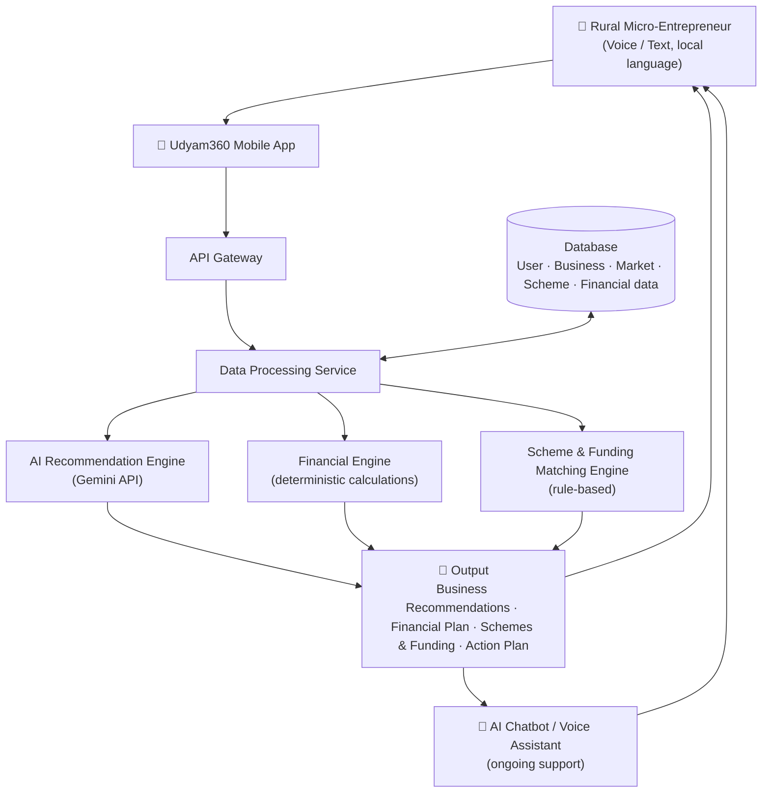
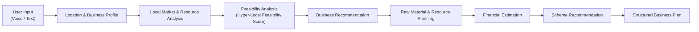

<div align="center">

# Udyam360

**AI-Driven Hyper-Local Business Advisory & Financial Structuring Assistant for Rural Micro-Entrepreneurs**


</div>

---

## 📖 Overview

Udyam360 analyzes local demand, resources, market conditions, and financial requirements to help rural entrepreneurs evaluate business opportunities and structure financing plans. It combines a generative AI advisory layer (Gemini) with a deterministic rule engine for financial calculations and government scheme matching, and is designed for multilingual voice and text interaction.

> **Project status:** Idea/prototype stage for Smart India Hackathon 2026. Technology choices below reflect the proposed design in the idea submission. `[Update implementation status after code is finalized]`

- **Live Demo:** `[Add Live Demo Link]`

---

## 📑 Table of Contents

- [Problem Statement](#-SIH26091)
- [Why Udyam360?](#-why-udyam360)
- [Solution Overview](#-solution-overview)
- [Key Features](#-key-features)
- [System Architecture](#-system-architecture)
- [Project Workflow](#-project-workflow)
- [Technology Stack](#-technology-stack)
- [Data Sources](#-data-sources)
- [AI / Rule-Based Logic](#-ai--rule-based-logic)
- [Core Modules](#-core-modules)
- [Screenshots](#-screenshots)
- [Installation](#%EF%B8%8F-installation)
- [Environment Variables](#-environment-variables)
- [Running the Project](#%EF%B8%8F-running-the-project)
- [API Documentation](#-api-documentation)
- [Project Structure](#-project-structure)
- [Impact](#-impact)
- [Future Enhancements](#-future-enhancements)
- [Limitations](#%EF%B8%8F-limitations)
- [Team](#-team)
- [Hackathon Information](#-hackathon-information)
- [References](#-references)
- [License](#-license)

---

## 🎯 Problem Statement

Rural micro-entrepreneurs face several obstacles when starting or scaling a business:

- **Uncertainty about business choice**: it is hard to know which business suits a specific locality.
- **Loan rejections**: applications are often rejected because business plans are unstructured or incomplete.
- **Generic portals**: existing portals are not advisory in nature and lack local feasibility checks.
- **Scheme discovery**: relevant government schemes, subsidies, and financial support are difficult to find.

---

## 💡 Why Udyam360?

| Gap in existing tools | How Udyam360 addresses it |
|---|---|
| Generic, non-advisory portals | Advisory output tailored to location and business profile |
| No local feasibility checks | Hyper-Local Feasibility Score (SWOT, competitor density, local demand signals) |
| Unstructured plans lead to loan rejection | Structured business plan with investment, cost, revenue, and profitability estimates |
| Hard-to-find schemes | Deterministic, rule-based scheme matching against the entrepreneur's profile |
| Language and literacy barriers | Multilingual voice and text interaction |

---

## 🧭 Solution Overview

Udyam360 provides four core capabilities:

1. **Hyper-Local Business Analysis** – Analyzes location, local demand, resources, and market conditions to suggest suitable businesses.
2. **Raw Material & Resource Planner** – Recommends the raw materials, resources, and approximate quantities required for the selected business.
3. **Financial & Loan Structuring** – Estimates investment, operating costs, revenue, and profitability, and generates a structured business plan for financing.
4. **Scheme & Support Recommendation** – Identifies relevant government schemes, subsidies, and financial support based on the entrepreneur's business profile.

**Unique selling points (from the proposal):**

- **Raw Material Suggestion**: analyzes local business categories and recommends essential raw materials based on demand and supply trends.
- **Area-Wise Density Analysis**: evaluates population density and the existing store/business ratio per area to suggest optimal locations for new ventures.

---

## ✨ Key Features

> Feature list follows the project proposal. `[Mark each feature as Implemented / In Progress / Planned once the codebase is final]`

| Feature | Description | Status |
|---|---|---|
| Hyper-local business analysis | Location, demand, resources, market conditions | `[Update]` |
| Hyper-Local Feasibility Score | SWOT + competitor density (OpenStreetMap) + local demand signals | `[Update]` |
| Raw material & resource planner | Materials, resources, approximate quantities | `[Update]` |
| Area-wise density analysis | Population density vs. existing business ratio | `[Update]` |
| Financial estimation | Investment, operating costs, revenue, profitability, EMI | `[Update]` |
| Structured business plan | Plan intended to support loan applications | `[Update]` |
| Scheme & subsidy matching | Deterministic, rule-based matching | `[Update]` |
| Multilingual voice/text interface | Voice and text input in local language | `[Update]` |
| AI chatbot / voice assistant | Ongoing support: queries, daily guidance, expense-tracking help, scheme updates | `[Update]` |
| Marketing content | Output layer includes marketing content generation | `[Update]` |

---

## 🏗 System Architecture



### Layered view (from the proposal)

| Layer | Components |
|---|---|
| **Input** | User query (voice/text), language detection & NLP processing |
| **Pre-processing** | Tokenization & context analysis, query classification & routing |
| **AI Core** | LLM (Gemini API): advisory & content generation, multilingual responses · Deterministic engine: financial calculations, eligibility validation |
| **Integration** | Government scheme APIs, location data & market stats, user database |
| **Output** | Feasibility report, scheme match recommendations, marketing content |

---

## 🔄 Project Workflow



The proposal's strategic roadmap groups these steps as: **Local Data → Feasibility → Finance + Scheme → AI Advisory → Voice + Marketing → Business Plan**.

---

## 🛠 Technology Stack

> The stack below is taken from the idea-submission document (proposed design). `[Verify against the final codebase before publishing]`

| Category | Technologies |
|---|---|
| **Mobile App** | Expo (framework) |
| **Web App** | React Native |
| **UI Styling** | Tailwind CSS |
| **Backend** | Python, FastAPI (REST APIs) |
| **Database** | Supabase, PostgreSQL (relational) `[Confirm which is used]` |
| **AI / ML** | Gemini API (LLM), Pinecone (vector database) |
| **Cloud & Hosting** | Render (backend), EAS Build |
| **Tools** | GitHub, VS Code, Postman |

Other technologies mentioned in the proposal's research section: Sarvam AI, OpenStreetMap. `[Confirm whether these are used]`

---

## 📊 Data Sources

| Source | Purpose |
|---|---|
| KVIC PMEGP | Scheme information |
| Mudra Yojana (PMMY) | Scheme information |
| MSME reports | Market and sector context |
| OpenStreetMap / Overpass API | Competitor density and location data |
| Data.gov India | Open government data |

**Also referenced in the proposal:** Ministry of MSME, MoSPI / ASUSE, RBI, NABARD, NITI Aayog, MSME Annual Reports; schemes including PMEGP, PMMY/MUDRA, Stand-Up India, PM Vishwakarma, and JanSamarth.

---

## 🧠 AI / Rule-Based Logic

Udyam360 separates generative AI from deterministic logic.

**AI layer (Gemini)**
- Advisory and content generation
- Multilingual responses

**Deterministic layer (rule engine)**
- Financial calculations
- Eligibility validation
- Rule-based scheme matching. The rules database can be updated when policies change.

**Hyper-Local Feasibility Score** combines:
- SWOT analysis
- Competitor density (via OpenStreetMap)
- Local demand signals

### Illustrative financing example (from the proposal)

| Parameter | Value |
|---|---|
| Project cost | ₹10,00,000 |
| Margin (10% of project cost) | ₹1,00,000 |
| Loan (covers 90%) | ₹9,00,000 |
| Interest rate | 11% p.a. |
| Tenure | 5 years (60 months) |
| Moratorium | 1 year |

EMI formula used: `EMI = P × r × (1+r)^n / ((1+r)^n − 1)`

> This example illustrates the proposal's calculation flow. `[Verify final EMI figures against the implemented calculation]`

**Evidence snapshot cited in the proposal:** PMEGP subsidy up to 35%, Mudra interest 7–12%, and a 30% rural MSME loan rejection rate. `[Add sources for each figure]`

---

## 🧩 Core Modules

| Module | Responsibility |
|---|---|
| API Gateway | Entry point for client requests |
| Data Processing Service | Pre-processes and routes queries |
| AI Recommendation Engine | Business recommendations and advisory content |
| Financial Engine | Investment, cost, revenue, profitability, EMI |
| Scheme & Funding Matching Engine | Rule-based scheme and subsidy matching |
| Chatbot / Voice Assistant | Ongoing multilingual user support |

---

## 📸 Screenshots

The proposal includes UI concept screens: onboarding ("Discover Local Opportunities"), "Understand Your Business", "AI Business Advisor", a home dashboard, and "Local Market Insights".

### Onboarding
`[Add Screenshot]`

### Dashboard
`[Add Screenshot]`

### Local Market Insights
`[Add Screenshot]`

### Business Analysis / Financial Plan
`[Add Screenshot]`

---

## ⚙️ Installation

Installation instructions will be added after the project structure and dependencies are finalized.

```bash
# [Add Installation Command]
```

---

## 🔐 Environment Variables

The required variables will be documented once the codebase is finalized. The proposal uses the Gemini API, so a Gemini API key is expected. `[Confirm variable names]`

```env
# Example placeholder – replace with actual variable names from your code
# GEMINI_API_KEY=your_api_key
```

> Never commit real API keys or secrets to the repository.

---

## ▶️ Running the Project

```bash
# [Add command to run backend]
# [Add command to run mobile/web frontend]
```

---

## 📡 API Documentation

The backend is planned as REST APIs using FastAPI. Endpoints will be documented here once implemented.

| Method | Endpoint | Purpose | Request | Response |
|---|---|---|---|---|
| `[Add]` | `[Add]` | `[Add]` | `[Add]` | `[Add]` |

If FastAPI is used, interactive docs are typically served at `/docs`. `[Confirm]`

---

## 🎬 Example Usage

`[Add a walkthrough: e.g., user enters location and business interest → receives feasibility score, resource plan, financial estimate, and matching schemes]`

---

## 📂 Project Structure

`[Add project tree after the repository is organized]`

```text
project-root/
└── README.md
```

---

## 🌍 Impact

| Area | Expected benefit |
|---|---|
| **Financial Inclusion** | Better business decisions; faster access to relevant schemes; improved scheme availability and utilization; supports PMJDY and Digital India |
| **Language & Accessibility** | Multilingual voice assistant guiding rural users step by step |
| **Digital Marketing** | Helps local enterprises expand their market regionally |

---

## 🚀 Future Enhancements

`[Add planned features. The proposal mentions ongoing support via chatbot/voice assistant and continuous learning & improvement, so mark these as planned if not yet built.]`

---

## ⚠️ Limitations

- Recommendations depend on the quality and coverage of available local data (e.g., OpenStreetMap).
- Scheme rules and interest rates change with policy; the rules database must be kept up to date.
- Financial figures are estimates intended to support planning, not guarantees of loan approval.

---

## 👥 Team

**Team BRUTEFORCE**

| Name | Role | Links |
|---|---|---|
| `[Add Name]` | `[Add Role]` | `[Add GitHub/LinkedIn]` |

---

## 🏆 Hackathon Information

| | |
|---|---|
| **Event** | Smart India Hackathon 2026 |
| **Problem Statement ID** | SIH26091 |
| **Problem Statement** | AI-Driven Hyper-Local Business Advisory and Financial Structuring Assistant for Rural Micro-Entrepreneurs |
| **Theme** | Agriculture, FoodTech & Rural Development |
| **Category** | Software |
| **Team Name** | BRUTEFORCE |
| **Team ID** | `[Add Team ID]` |

---

## 📚 References

**Research papers**
1. AI-Driven Finance & Rural Inclusion (2026) – `[Add Link]`
2. Financial Inclusion in Rural India (2026) – `[Add Link]`
3. Financial Inclusion & Rural Entrepreneurship (2026) – `[Add Link]`
4. AI Financial Literacy for Rural Women (2025) – `[Add Link]`

**Blogs / articles**

5. Vyapar Mitra – AI Business Assistant – `[Add Link]`
6. AI-Led Banking for Rural India (2026) – `[Add Link]`

---

## 📄 License

`[Add License, e.g., MIT / Apache-2.0 / All Rights Reserved]`
